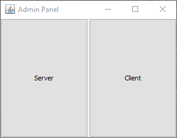
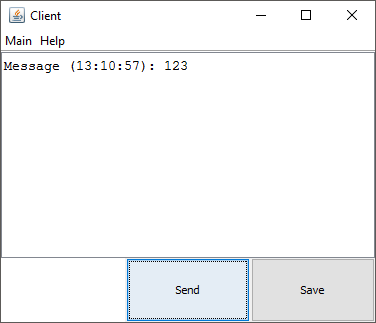
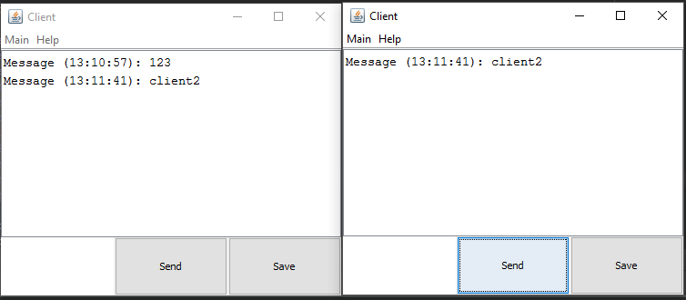

# SimpleChat
Server + Clients local chat on Java (Swing)

Admin panel allows to start listening Server and then as much Clients as we want.

Clients share same chat, so they can text each other.

## Screenshots:

